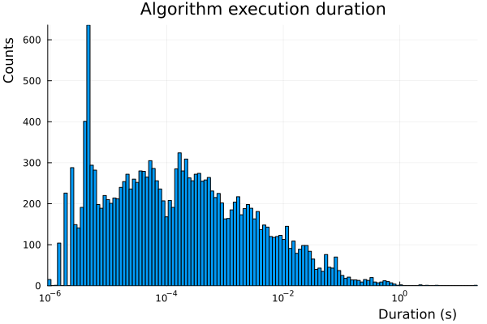
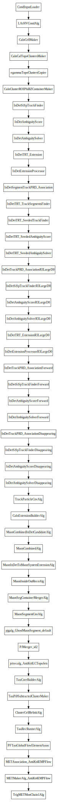

# q449

Standard reconstruction test job

- release: Athena/25.0.4
- build: x86_64-el9-gcc13-opt
- platform: AMD Ryzen 7 5700G with Radeon Graphics (16) @ 3.800GHz
- Command:
  ```sh
  ATHENA_CORE_NUMBER=8 Reco_tf.py --multithreaded --AMIConfig q449 --preExec "ConfigFlags.PerfMon.doFullMonMT=True" --postExec "from AthenaConfiguration.ComponentFactory import CompFactory;from GaudiHive.GaudiHiveConf import PrecedenceSvc; cfg.addService(CompFactory.PrecedenceSvc(DumpPrecedenceRules=True))"
  ```
## Algorithm execution duration

| | |
|-|-|
| min    | 9.08e-07 s |
| median | 1.40e-04 s |
| mean  | 9.01e-03 s |
| max   | 2.15e+01 s |
| std   | 1.77e-01 s |



## Critical path

Number of algorithms in critical path: 49  
Critical path length: 2.14 s


