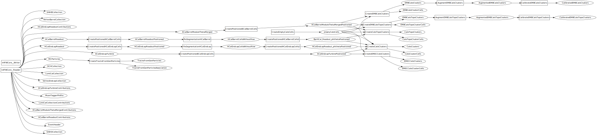
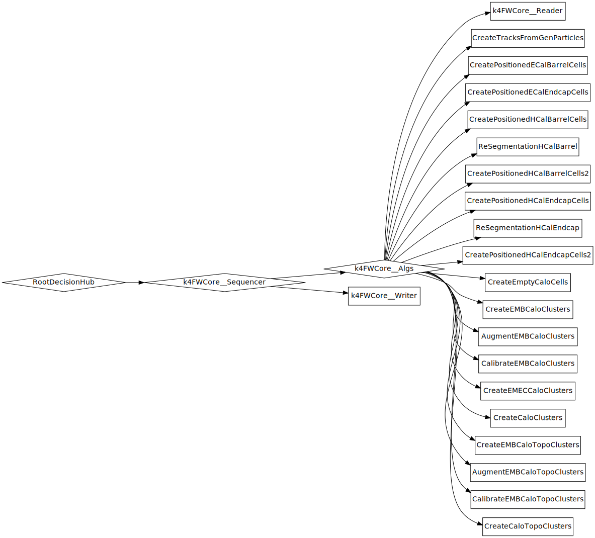
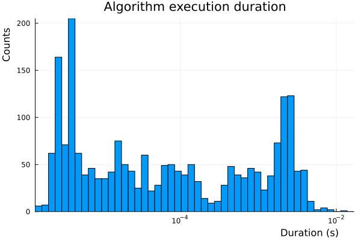

# ALLEGRO_o1_v3

Full simulation of ALLEGRO detector option 1 version 3

- release: /cvmfs/sw-nightlies.hsf.org/key4hep/setup.sh -r 2024-10-31
- build: x86_64-el9-gcc14.2.0-opt
- platform: AMD Ryzen 7 5700G with Radeon Graphics (16) @ 3.800GHz
- Command:
  ```sh
  k4run run_digi_reco.py
  ```

## Data flow



## Control flow



## Algorithm execution duration

|         |            |
| ------- | ---------- |
| min:    | 1.40e-06 s |
| median: | 4.74e-05 s |
| mean:   | 6.84e-04 s |
| max:    | 1.68e-02 s |
| std:    | 1.19e-03 s |


