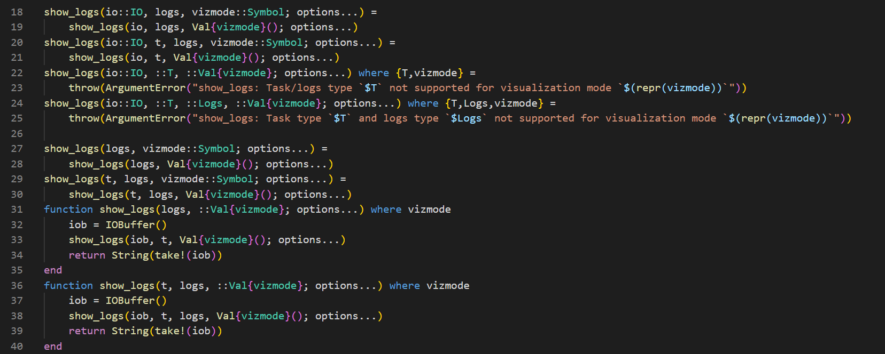
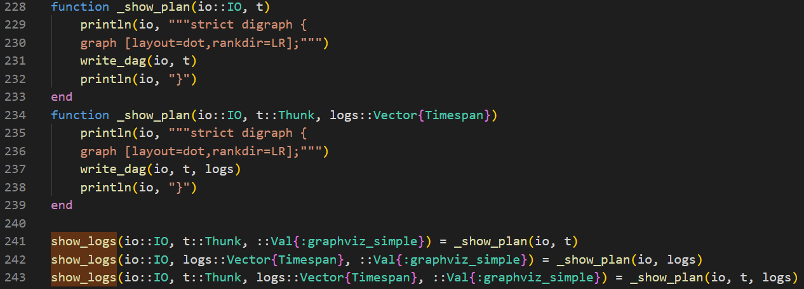
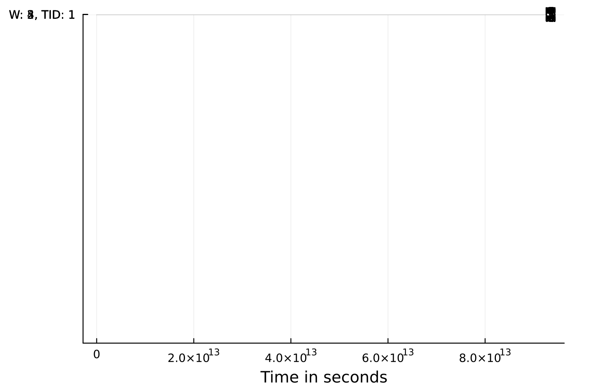
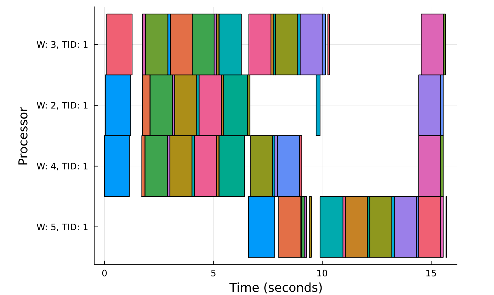

# Logging in Dagger

Dagger documentation mentions several ways to get and use scheduler logs. In this directory you can find the relevant examples.

**IMPORTANT**

Essential problem of logging in Dagger is that it may work differently for old and new API.

The examples and the herein text are relevant as of the Dagger 0.18.11 (unless otherwise stated)

## Getting logs

Currently there are essentially two ways to get logs: low-level usage of log_sinks (which define how the logs will be collected and processed) and high-level interface (`enable_logging!()`, `fetch_logs!()` functions). The corresponding sections will describe each in more detail and provide some examples of their usage.

### log_sink

Log_sink is a mechanism used to determine, how the logs are collected and processed. There are two types of log_sinks (there are also other ones, but this are most widely used): straightforward LocalEventLog, which saves logs directly into the arrays contained in each worker, and the more modern MultiEventLog, which documentation recommends to use, and which comprises of consumers processing events (consumer may be responsible for some specific type of info) and aggregators.

Importantly, `LocalEventLog` stores raw events (`Dagger.TimespanLogging.Event`), whereas `MultiEventLog` processes them with consumers functions first, putting their results to the corresponding to this consumer array.

The folder "getting_logs/log_sink" contains the examples of directly getting logs using the log_sink parameter of the Dagger.Context. 

On `get_logs!()` both the `LocalEventLog` and `MultiEventLog` gather what they have stored on all workers so far and return that as a result of this function (by default, `LocalEventLog` additionally transforms events into timespans combining start_events and finish_events). Note that all the returned logs are cleaned up, so, for example, immediately calling `get_logs()` second time after the first one will return nothing.

Another function, which can be used to get logs is `fetch_logs!()` (currently it is just alias for the `TimespanLogging.get_logs!(Dagger.Sch.eager_context())`)

### enable_logging

A new way to get logs, added recently is the `enable_logging!()`. It is a function to activate preconfigured logging mechanism (it uses `MultiEventLog` under the hood anyway). Use `fetch_logs!()` to retrieve the logs then. Check the corresponding example for more details.

## Processing logs

The focus here is to get the result in a `.dot` format to interpret it as a graph. This can be achieved via `Dagger.show_logs()` function. Essentially it gets the vector of timespans (of events), transforms them and writes result (`.dot` format) to an io object. As mentioned earlier, `LocalEventLog` stores raw events; however, `get_logs!(::LocalEventLog; ...)` transforms them into the timespans, which are the inputs to a `Dagger.show_logs()`. All of that happens under the hood, however, this is not the case for `MultiEventLog`, as it does not store raw events. Therefore, by default, only the `LocalEventLog` can generate logs suitable to use for graph plotting.

!!! Important 

Due to a known issues, currently (as of Dagger 0.18.11) `show_logs()` function contains a few bugs, which make the correct visualization not possible. Check [this](https://github.com/JuliaParallel/Dagger.jl/pull/531) pull request for the details. For now, examples use modified version of `GraphVizSimpleExt.jl` contained in the project and resolving this issue. 

### Show logs 

The `show_logs` function may be used to return the DAG representation in a `.dot` format with some metadata.

`show_logs` function is essentially defined only if `Colors` package is imported/used - you will get a "Not implemented" error else. That is the code implementing it:

If `Colors` package is defined, the following definitions of `show_logs` are added:

#### viz_oldAPI_localeventlog.jl

Here, the `LocalEventLog` type of `log_sink` is used with the old API of Dagger (`Dagger.delayed`). This results in logs being written in the corresponding log file in the `.dot` format (it is important to import `Colors` package, as it also enables the relevant Dagger function) and visualized in another `.png` file.

#### viz_oldAPI_multieventlog.jl

This file contains the combination of old Dagger API and `MultiEventLog` as the log_sink. However, only `LocalEventLog` can be used directly with the `show_logs()`, due to how `Event`s are processed in `MultiEventLog`. In order to eventually write the logs to a file in a `.dot` format, one can use `Dagger.TimespanLogging.Events.FullMetrics` consumer which does nothing to the input event and return it as is, which is identical to `LocalEventLog` behaviour. Then, the workflow for the latter one can be reproduced.

#### viz_modernAPI_localeventlog.jl

Modern Dagger API and `LocalEventLog` `log_sink` are combined here. 

#### viz_modernAPI_multieventlog.jl

Modern Dagger API used with `MultiEventLog`. The same kind of workaround is applied, as earlier (viz_oldAPI_multieventlog.jl).

#### viz_raw_enable_logging_oldAPI.jl

This example contains an attempt to use `enable_logging!()` with `show_logs()`, which causes an error. This is intentionally left example to show that some kind of workaround is needed.

#### viz_enable_logging_oldAPI

This example is similar to the previous one, except that now additional processing is applied to logs (as mentioned earlier, `MultiEventLog` is used under the hood in `enable_logging!()`, so the same workaround has been applied here).

#### viz_enable_logging_modernAPI.jl

The same as the previous one, but with the modern API. Should not work as of Dagger 0.18.11 (but works using modified `GraphVizSimpleExt`), however, should be fixed soon.

## Visualizing logs

### Custom logs vizualization

Such vizualization can be seen in the examples for the previous section.

### Webdash

Webdash does not seem to work as of Dagger 0.18.11.

### Render Logs

The corresponding folder contains examples of the `render_logs()` function use.

`:graphviz` does not seem to generate graphs properly for now. Also sometimes throws `KeyError`.

`:plots_gantt_ps` displays the following result:

`:plots_gantt`:

